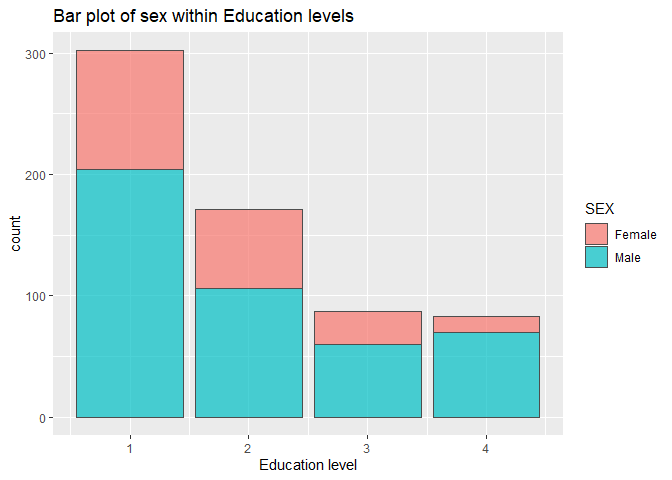
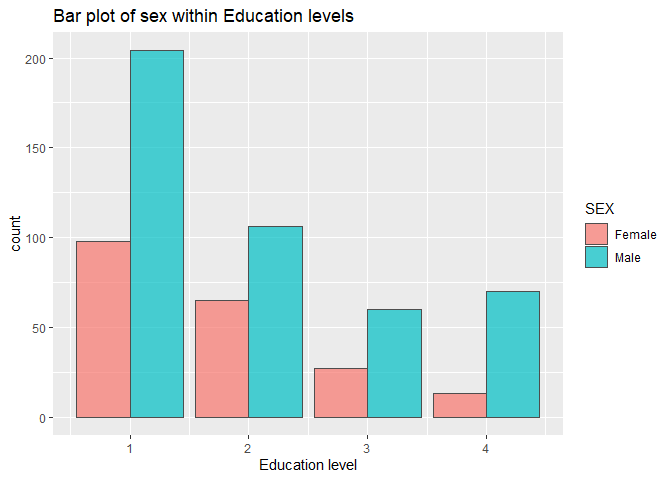
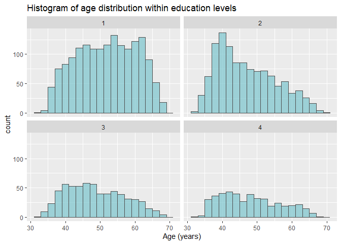

We continue from yesterday by exploring the relationship between
variables, both with visualisations and statistical tests. Don’t forget
to turn your R scripts into the Blackboard.

-----

## Part 1: Visualizing Distributions

First, we must load in the dataset again.

``` r
fhs <- read.csv(url("https://raw.githubusercontent.com/molepi/Molecular-Data-Science/master/RIntro_practical/data.csv"))
```

We should also load in the `tidyverse` package, and remove missing
values as we did yesterday.

``` r
library(tidyverse)
```

    ## -- Attaching packages ------------------------------------ tidyverse 1.2.1 --

    ## v ggplot2 3.2.1     v purrr   0.3.2
    ## v tibble  2.1.3     v dplyr   0.8.3
    ## v tidyr   1.0.0     v stringr 1.4.0
    ## v readr   1.3.1     v forcats 0.4.0

    ## -- Conflicts --------------------------------------- tidyverse_conflicts() --
    ## x dplyr::filter() masks stats::filter()
    ## x dplyr::lag()    masks stats::lag()

``` r
fhs <- fhs[complete.cases(fhs), ]
```

The package `ggplot2` is commonly used to produce visualisations of
data. The plots will appear in the **Plots** pane, you can save them
using the Export button if you would like.

The `ggplot` function works by adding `geom` elements. For example,
`geom_density` can be used to investigate the distribution of a
variable.

``` r
ggplot(fhs, aes(BMI)) + geom_density()
```

<!-- -->

This is not really a very pretty visualisation, however. One of the nice
aspects of `ggplot2` is that you can iteratively build up graphics until
they look as you want them to.

-----

Let’s add some nicer colours and a title.

``` r
ggplot(fhs, aes(BMI)) + 
  geom_density(fill="#72B6C5", color="#ffffff00", alpha=0.6) +
  ggtitle("Distribution of BMI in the Framingham Heart Study")
```

<!-- -->

-----

We can also look at variable’s distribution using a bar plot with
`geom_bar` or a histogram with `geom_histogram`.

``` r
ggplot(fhs, aes(SEX)) + 
  geom_bar(fill="#72B6C5", color="grey90", alpha=0.6) +
  ggtitle("Bar plot of sex in the Framingham Heart Study")
```

<!-- -->

-----

Some themes are also available for use with `ggplot`.

``` r
ggplot(fhs, aes(AGE)) + 
  geom_histogram(binwidth = 1, color="grey90", alpha=0.6) + theme_bw() +
  ggtitle("Histogram of age in the Framingham Heart Study")
```

<!-- -->

-----

Maybe we want to view ages in males and females separately. For this, we
can use `facet_grid` with the `formula` class we looked at yesterday.

``` r
ggplot(fhs, aes(x=AGE, fill=SEX)) + 
  geom_histogram(binwidth = 5, color="grey90", alpha=0.6) +
  ggtitle("Histogram of age by sex in the Framingham Heart Study") +
  facet_grid(SEX ~ .)
```

<!-- -->

-----

You can quickly build up attractive graphics in R. Subsetting with
`dplyr` can also be utilised with `ggplot2`.

Say, we want to visualise the distribution of age by sex only in
overweight individuals.

``` r
fhs %>%
  filter(BMI>30) %>%
  ggplot(aes(x=AGE, fill=SEX)) + 
  geom_histogram(binwidth = 5, color="grey90", alpha=0.6) +
  ggtitle("Histogram of age by sex in overweight individuals") +
  facet_grid(SEX ~ .)
```

<!-- -->

-----

#### Question 1:

  - Make a bar plot of MI
  - Make a histogram of total cholesterol
  - Make a density plot of glucose levels for individuals with diabetes
  - Make a histogram of systolic blood pressure by sex for those who
    experienced MI
  - Make a histogram of pulse pressure for overweight and underweight
    individuals who do and do not smoke

-----

## Part 2: Comparative Plots

A scatter plot can be a good way to compare two continuous variables. In
`ggplot` this is implemented using `geom_point()`.

``` r
ggplot(fhs) + 
  geom_point(aes(x=SYSBP, y=DIABP), alpha=0.6) +
  ggtitle("Scatter plot of BMI against glucose level")
```

<!-- -->

If you would like to colour points by another variable, specify it with
the `color` option. You can use this to try and identify clusters and
patterns in your data.

``` r
ggplot(fhs) + 
  geom_point(aes(x=BMI, y=GLUCOSE, color=DIABETES), alpha=0.6) +
  ggtitle("Scatter plot of BMI against glucose level") 
```

<!-- -->

Sometimes, it can be useful to see if the relationship between two
variables is different in various groups.

``` r
ggplot(fhs) + 
  geom_point(aes(x=BMI, y=GLUCOSE, color=DIABETES), alpha=0.6) +
  facet_wrap(~SEX) +
  ggtitle("Scatter plot of BMI against glucose level by sex")
```

<!-- -->

You can also use the `cut()` function to create categorical variables,
to help with visualisations.

``` r
ggplot(fhs) +
  geom_point(aes(x=SYSBP, y=DIABP, color=BPMEDS), alpha=0.6) +
  ggtitle("Scatter plots of systolic against diastolic blood pressure for different age groups") +
  facet_wrap(. ~ cut(AGE,c(30,40,50,60,70)))
```

<!-- -->

To compare variables, you can also use box plots. These are specified
using `geom_boxplot()`.

``` r
ggplot(fhs) + 
  geom_boxplot(aes(x = MI, y = AGE, fill=MI), alpha=0.6) +
  ggtitle("Box plot of age by MI category")
```

<!-- -->

-----

#### Question 2:

  - Make a scatter plot of BMI against total cholesterol
  - Make a box plot of MI and BMI for males over the age of 40
  - Make a scatter plot of total cholesterol against glucose for
    categories of BMI

-----

## Part 3: Statistical Tests

Next we will perform some statistical tests. Sometimes, it can be
helpful to save tables so that they can be used in other functions.

``` r
SMOKE_MI <- xtabs(~CURSMOKE+MI, fhs)
SMOKE_MI
```

    ##         MI
    ## CURSMOKE   No  Yes
    ##      No  1671  291
    ##      Yes 1537  352

Then, we can use a Chi-Square test, to see if there is an association
between smoking status and MI.

``` r
chisq.test(SMOKE_MI)
```

    ## 
    ##  Pearson's Chi-squared test with Yates' continuity correction
    ## 
    ## data:  SMOKE_MI
    ## X-squared = 9.7325, df = 1, p-value = 0.00181

Perhaps, the scatter plot above suggested a positive correlation between
systolic and diastolic blood pressure, but we want to investigate this
further.

We can use `cor.test` to show the correlation between two variables.

``` r
cor.test(~ SYSBP + DIABP, fhs) 
```

    ## 
    ##  Pearson's product-moment correlation
    ## 
    ## data:  SYSBP and DIABP
    ## t = 78.845, df = 3849, p-value < 2.2e-16
    ## alternative hypothesis: true correlation is not equal to 0
    ## 95 percent confidence interval:
    ##  0.7734942 0.7976652
    ## sample estimates:
    ##       cor 
    ## 0.7858797

This shows that we have significant evidence from our data that systolic
and diastolic blood pressure are strongly correlated (r=0.79, p\<0.001).

-----

Visualizations can often inform future statistical investigations. The
box plot shown above might suggest that older individuals are more
likely to have experienced MI.

We can formally test this using a t-test:

``` r
t.test(AGE ~ MI, fhs) 
```

    ## 
    ##  Welch Two Sample t-test
    ## 
    ## data:  AGE by MI
    ## t = -9.0315, df = 918.42, p-value < 2.2e-16
    ## alternative hypothesis: true difference in means is not equal to 0
    ## 95 percent confidence interval:
    ##  -4.072404 -2.618479
    ## sample estimates:
    ##  mean in group No mean in group Yes 
    ##          49.34352          52.68896

This test concludes that we have sufficient evidence to suggest a
difference in age between those who had and did not have MI (p\<0.001).

-----

``` r
fit <- glm(MI ~ AGE, fhs, family = "binomial") # is AGE associated with MI (logistic regression)
summary(fit)
```

    ## 
    ## Call:
    ## glm(formula = MI ~ AGE, family = "binomial", data = fhs)
    ## 
    ## Deviance Residuals: 
    ##     Min       1Q   Median       3Q      Max  
    ## -0.8594  -0.6552  -0.5454  -0.4712   2.1974  
    ## 
    ## Coefficients:
    ##              Estimate Std. Error z value Pr(>|z|)    
    ## (Intercept) -3.879666   0.266737  -14.54   <2e-16 ***
    ## AGE          0.044548   0.005051    8.82   <2e-16 ***
    ## ---
    ## Signif. codes:  0 '***' 0.001 '**' 0.01 '*' 0.05 '.' 0.1 ' ' 1
    ## 
    ## (Dispersion parameter for binomial family taken to be 1)
    ## 
    ##     Null deviance: 3474.0  on 3850  degrees of freedom
    ## Residual deviance: 3394.5  on 3849  degrees of freedom
    ## AIC: 3398.5
    ## 
    ## Number of Fisher Scoring iterations: 4

#### Question 5:

  - Is AGE correlated with TOTCHOL?
  - Is MI associated with GLUCOSE?
  - Is MI associated with GLUCOSE in individuals with diabetes?

-----

## Part 9: Loops

One of the advantages of using R is to use loops to perform multiple
analyses at once. As an example, the following loop calculates the
association of MI with all the other variables and stores them in a data
frame.

``` r
results <- data.frame()       # Create empty data frame
for (i in colnames(fhs)[-ncol(fhs)]) { # Loop over all column names except MI
  fit <- glm(MI ~ get(i), fhs, family = "binomial") # Fit a model for the i-th column
  results <- rbind(results, summary(fit)$coefficients[2, , drop = FALSE]) # rbind second row of coefficients to results, first row is intercept
}
rownames(results) <- colnames(fhs)[-ncol(fhs)] # Add row names
results$OR <- exp(results$Estimate) # Add odds ratio
results[order(results$"Pr(>|z|)"), ] # Order results by P-value
```

    ##              Estimate   Std. Error   z value     Pr(>|z|)        OR
    ## SEX       1.153381422 0.0921407197 12.517608 5.981047e-36 3.1688902
    ## SYSBP     0.018909221 0.0017797581 10.624602 2.289869e-26 1.0190891
    ## AGE       0.044548141 0.0050507477  8.820108 1.143491e-18 1.0455553
    ## TOTCHOL   0.008106879 0.0009512993  8.521902 1.569545e-17 1.0081398
    ## DIABP     0.028722602 0.0034015327  8.444018 3.066132e-17 1.0291391
    ## DIABETES  1.307439829 0.1995849643  6.550793 5.723227e-11 3.6966974
    ## BMI       0.065226891 0.0099964058  6.525034 6.798595e-11 1.0674012
    ## GLUCOSE   0.008529646 0.0014836425  5.749125 8.970668e-09 1.0085661
    ## BPMEDS    0.782504278 0.1961813118  3.988679 6.644226e-05 2.1869421
    ## CURSMOKE  0.273897693 0.0867548074  3.157147 1.593209e-03 1.3150803
    ## EDUC     -0.059809137 0.0427093732 -1.400375 1.614011e-01 0.9419443

This is quite a complicated loop, but we can dissect the different parts
to get an idea of what loops in R consist of.

-----

An if-statement is only run if the condition is true.

``` r
if (1 < 2) { # if 1 smaller then 2
  print("1 is smaller than 2") # print "1 is smaller than 2"
}
```

    ## [1] "1 is smaller than 2"

An else-statement is only run if the condition of the if-statement is
false.

``` r
if (1 > 2) {
  print("1 is greater than 2")
} else {
  print("1 is not greater than 2")
}
```

    ## [1] "1 is not greater than 2"

-----

With for-loops you assign a range of values (in the example values 1 to
10) to a variable (in the example variable i) and perform the actions in
the loop for all these values in order (1 first, 10 last).

``` r
for (i in 1:10) { # loop over values 1 to 10
  if (i < 5) {
    print(paste(i, "is smaller than 5"))
  } else {
    print(paste(i, "is not smaller than 5"))
  }
}
```

    ## [1] "1 is smaller than 5"
    ## [1] "2 is smaller than 5"
    ## [1] "3 is smaller than 5"
    ## [1] "4 is smaller than 5"
    ## [1] "5 is not smaller than 5"
    ## [1] "6 is not smaller than 5"
    ## [1] "7 is not smaller than 5"
    ## [1] "8 is not smaller than 5"
    ## [1] "9 is not smaller than 5"
    ## [1] "10 is not smaller than 5"

-----

You can also utilise loops and make your own functions in R.

``` r
greater <- function(x, y) { # function requires arguments x and y
  if (x > y) {
    paste(x, "is greater than", y)
  } else {
    paste(x, "is not greater than", y)
  }
}
greater(1, 2)
```

    ## [1] "1 is not greater than 2"

``` r
greater(2, 1)
```

    ## [1] "2 is greater than 1"

-----

#### Question 6:

  - Make a function that requires as arguments x, y and z and returns
    their product.
  - Make a loop that returns the association of all columns of data
    frame fhs with AGE, instead of using *glm* you can use *lm*.

-----

This practical ends with you writing your own simple function, but
hopefully you can see how complicated your functions can become. You can
do so many things in R, and new functions are being written all the
time, but if a function to do something doesn’t exist, you can always
try to create your own.

-----
