We continue from yesterday by exploring the relationship between
variables, both with visualisations and statistical tests. Don’t forget
to turn your R scripts into the Blackboard.

-----

## Part 1: Introduction to ggplot2

First, we must load in the dataset again, keeping only complete cases.

``` r
fhs <- read.csv(url("https://raw.githubusercontent.com/molepi/Molecular-Data-Science/master/RIntro_practical/data.csv"))
fhs <- fhs[complete.cases(fhs), ]
```

We should also set our library location and load in the `tidyverse`
package.

``` r
.libPaths("C:/fos_2019/library")
```

``` r
library(tidyverse)
```

-----

The package `ggplot2` is commonly used to produce visualisations of
data. The plots will appear in the **Plots** pane, you can save them
using the Export button if you would like.

The `ggplot()` function alone just initializes a blank plot. You can
specify your x and y axis using `aes()`, but no lines or points will be
drawn. You can pipe your data to `ggplot()` using `%>%` or specify it as
the first argument.

``` r
fhs %>%
  ggplot(aes(BMI, GLUCOSE))
```

<!-- -->

-----

Titles can be specified by adding `ggtitle()` to the `ggplot()` function
with the `+` operator. X and Y axis labels can also be implemented with
`xlab()` and `ylab()`, respectively.

``` r
fhs %>%
  ggplot(aes(BMI, GLUCOSE)) +
  ggtitle("Graph of BMI against Glucose levels") +
  xlab("BMI (kg/m^2)") +
  ylab("Glucose level (mg/dL")
```

<!-- -->

-----

In order to add data visualisation to our graph, we need to add `geom`
elements. One of these, `geom_bar()` is used to create bar charts for
categorical variables.

The `aes()` function can be moved inside the `geom_bar()`, which is
useful if you want to overlap multiple `geom` elements showcasing
different aspects of your data.

Additionally, `alpha`, `colour`, and `fill` options can specify the
appearance of the bars. Note, you can spell colour either the American
or English way - both are accepted as arguments. Changing these options
can be done for other `geom` elements as well.

``` r
fhs %>%
  ggplot() +
  geom_bar(aes(EDUC), alpha=0.7, colour='grey30', fill='cadetblue2') +
  ggtitle("Bar plot of Education levels") + 
  xlab("Education level") 
```

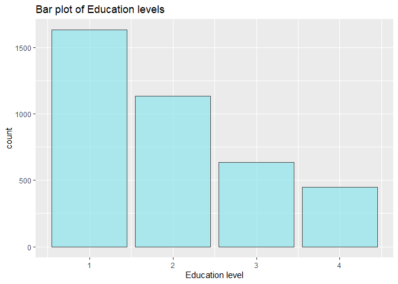<!-- -->

-----

Bars can be coloured by other variables to see the distribution of one
category within another. This is done by moving the `fill` option inside
the `aes()` function and specifying a categorical variable.

``` r
fhs %>%
  ggplot() +
  geom_bar(aes(EDUC, fill=SEX), alpha=0.7, color='grey30') +
  ggtitle("Bar plot of sex within Education levels") + 
  xlab("Education level") 
```

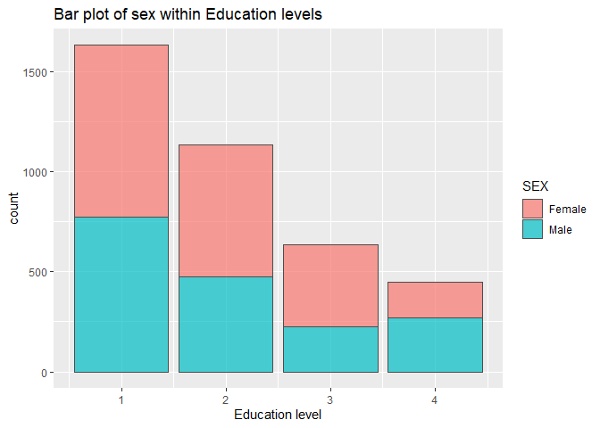<!-- -->

-----

Subsetting, as shown yesterday with `dplyr` can also be piped into
`ggplot()`. We can show the above graph only for those who experienced
MI, for example.

``` r
fhs %>%
  filter(MI == 'Yes') %>%
  ggplot() +
  geom_bar(aes(EDUC, fill=SEX), alpha=0.7, color='grey30') +
  ggtitle("Bar plot of sex within Education levels") + 
  xlab("Education level") 
```

<!-- -->

-----

To view bars side-by-side instead of stacked, set `position` to `dodge`.

``` r
fhs %>%
  filter(MI == 'Yes') %>%
  ggplot() +
  geom_bar(aes(EDUC, fill=SEX), alpha=0.7, color='grey30', position="dodge") +
  ggtitle("Bar plot of sex within Education levels") + 
  xlab("Education level") 
```

<!-- -->

-----

For continuous variables, we divide the x axis into bins and visualize
using `geom_histogram()`.

``` r
fhs %>%
  ggplot() +
  geom_histogram(aes(AGE), binwidth=2, alpha=0.7, colour='grey30', fill='cadetblue3') +
  ggtitle("Histogram of age distribution") +
  xlab("Age (years)")
```

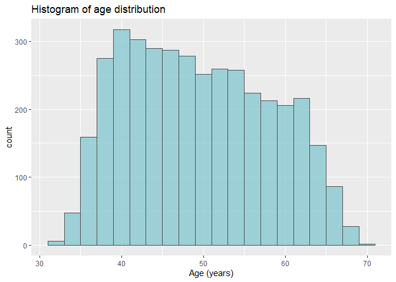<!-- -->

-----

To show the distribution of a continuous variable within categories, you
can use `facet_wrap()` which takes a `formula` class as an argument.
Separating plots by group using `facet_wrap()` is possible for most
`ggplot` graphics.

``` r
fhs %>%
  ggplot() +
  geom_histogram(aes(AGE), binwidth=2, alpha=0.7, colour='grey30', fill='cadetblue3') +
  facet_wrap(~EDUC) +
  ggtitle("Histogram of age distribution within education levels") +
  xlab("Age (years)")
```

<!-- -->

-----

In order to show a smoothed version of a histogram, a density plot, we
use `geom_density`.

``` r
fhs %>%
  ggplot() +
  geom_density(aes(SYSBP), alpha=0.7, colour='grey30', fill='cadetblue2') +
  ggtitle("Density plot of systolic blood pressure") +
  xlab("Systolic BP (mmHg)")
```

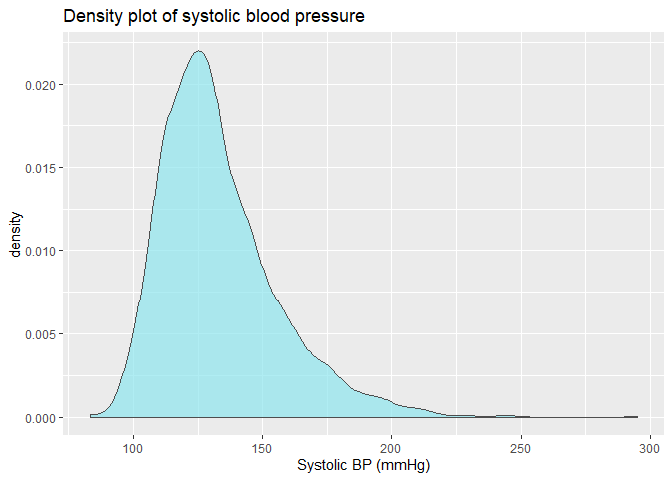<!-- -->

-----

If you want to look at a variable’s distribution between groups, use the
`fill` option within `aes()`.

``` r
fhs %>%
  ggplot() +
  geom_density(aes(SYSBP, fill=BPMEDS), alpha=0.7, colour='grey30') +
  ggtitle("Density plot of systolic blood pressure within BP medication status") +
  xlab("Systolic BP (mmHg)")
```

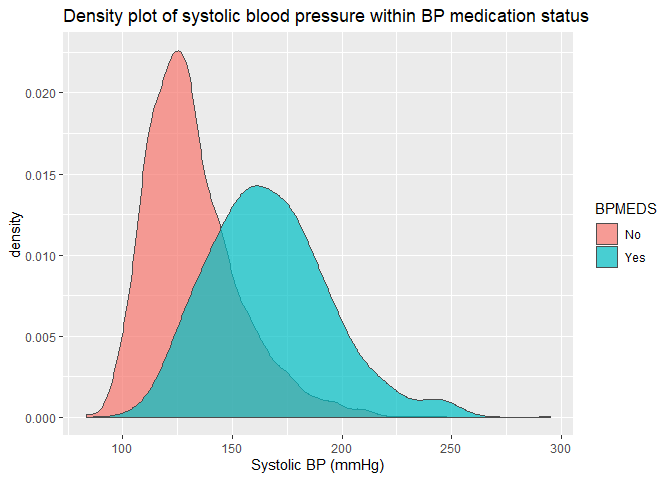<!-- -->

-----

This will show the distributions separately, but you can also stack them
with a `position` argument.

``` r
fhs %>%
  ggplot() +
  geom_density(aes(SYSBP, fill=BPMEDS), alpha=0.7, colour='grey30', position="stack") +
  ggtitle("Density plot of systolic blood pressure within BP medication status") +
  xlab("Systolic BP (mmHg)")
```

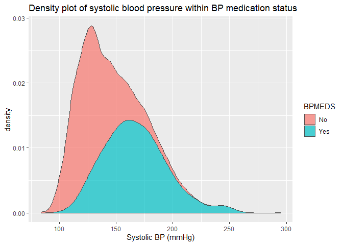<!-- -->

-----

#### Question 1: Make the following:

  - A bar plot of MI, coloured by smoking status
  - A histogram of total cholesterol in overweight individuals
  - Four density plots of age for each education level
  - Two bar plots of sex in current and non-smokers for those who
    experienced MI

-----

## Part 2: Comparative Plots

A scatter plot can be a good way to compare two continuous variables. In
`ggplot` this is implemented using `geom_point()`.

``` r
fhs %>%
  ggplot() +
  geom_point(aes(SYSBP, DIABP), alpha=0.7) +
  ggtitle("Scatter plot of Systolic BP against Diastolic BP") +
  xlab("Systolic BP (mmHg)") +
  ylab("Diastolic BP (mmHg)")
```

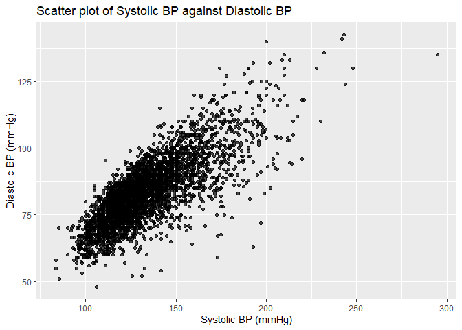<!-- -->

-----

Reference lines can be added to plots using `geom_vline()`,
`geom_hline()`, and `geom_abline()`. These are very useful for
annotating plots.

``` r
fhs %>%
  ggplot() +
  geom_point(aes(SYSBP, DIABP), alpha=0.7) +
  geom_vline(aes(xintercept=160), color='red', size=1.5, alpha=0.7) +
  ggtitle("Scatter plot of Systolic BP against Diastolic BP") +
  xlab("Systolic BP (mmHg)") +
  ylab("Diastolic BP (mmHg)")
```

<!-- -->

-----

You can also use the `cut()` function alongside `seq()` to create
categorical variables, to help with visualisations. `cut()` will divide
its first argument by values specified in the second. The syntax of
`seq()` is `start`, `end`, `interval`, so the example below specifies
the vector `(30, 40, 50, 60, 70)`.

``` r
fhs %>%
  ggplot() +
  geom_point(aes(SYSBP, DIABP), alpha=0.7) +
  geom_vline(aes(xintercept=160), color='red', size=1.5, alpha=0.7) +
  ggtitle("Scatter plot of Systolic BP against Diastolic BP") +
  xlab("Systolic BP (mmHg)") +
  ylab("Diastolic BP (mmHg)") +
  facet_wrap( ~ cut(AGE,seq(30,70,10)))
```

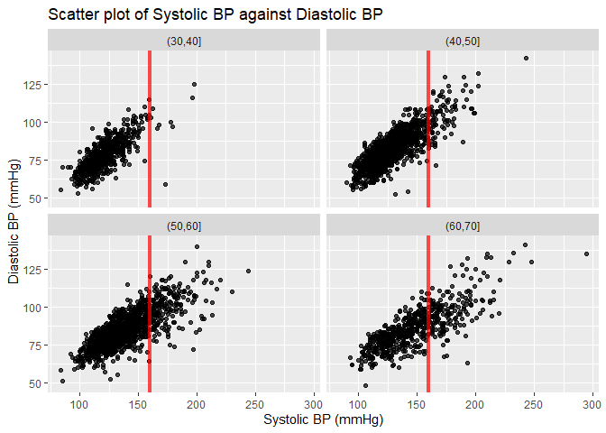<!-- -->

-----

To show the distribution of a continuous variable across categories, you
can use `geom_boxplot()`. This visualizes the median, upper and lower
quartiles, and two whiskers, which extend to 1.5 IQRs. All outlying
points are shown individually.

``` r
fhs %>%
  ggplot() +
  geom_boxplot(aes(CURSMOKE, BMI), color='grey30', fill='cadetblue2') +
  ggtitle("Distribution of BMI within smoking status") +
  xlab("Current smoking status") +
  ylab("BMI (kg/m^2)")
```

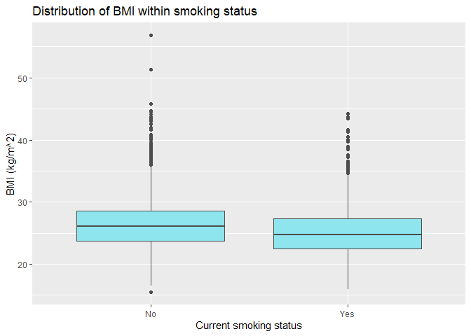<!-- -->

-----

If you want to view a horizontal boxplot, you can use `coord_fip()`.
Outliers can also be highlighted by changing their colour and shape.

``` r
fhs %>%
  ggplot() +
  geom_boxplot(aes(CURSMOKE, BMI), color='grey30', fill='cadetblue2', outlier.color='palegreen3', outlier.shape=1) + 
  coord_flip() +
  ggtitle("Distribution of BMI within smoking status") +
  xlab("Current smoking status") +
  ylab("BMI (kg/m^2)")
```

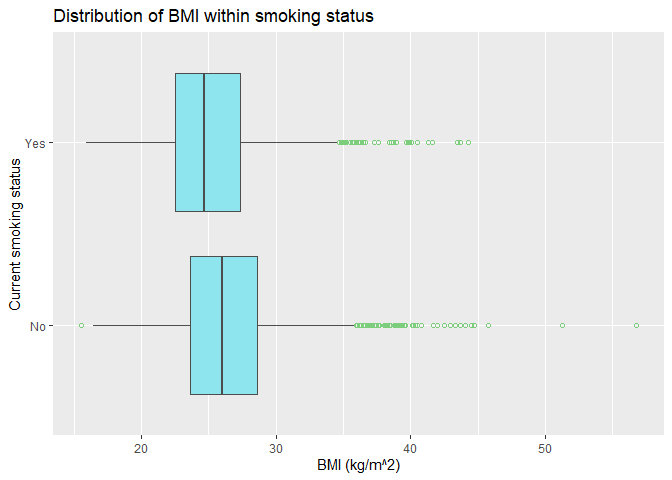<!-- -->

-----

Finally, box plots can also be split by a further category using the
`fill` or `color` options within `aes()`.

``` r
fhs %>%
  ggplot() +
  geom_boxplot(aes(CURSMOKE, BMI, fill=SEX), color='grey30', outlier.color='palegreen3', outlier.shape=1) + 
  coord_flip() +
  ggtitle("Distribution of BMI within smoking status") +
  xlab("Current smoking status") +
  ylab("BMI (kg/m^2)")
```

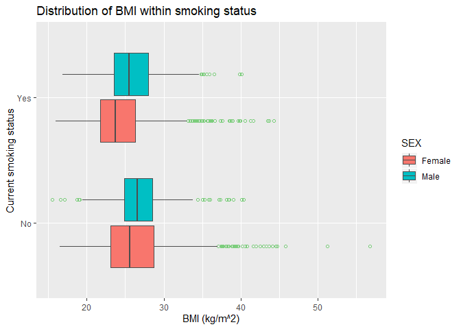<!-- -->

-----

#### Question 2: Make the following:

  - A scatter plot of glucose levels against BMI, coloured by diabetes
    status.
  - A horizontal box plot of systolic BP by sex for people over the age
    of 60
  - A scatter plot of total cholesterol against glucose for categories
    of BMI

-----

## Part 3: Statistical Tests

Next we will perform some statistical tests. Sometimes, it can be
helpful to save tables so that they can be used in other functions.

``` r
SMOKE_MI <- xtabs(~CURSMOKE+MI, fhs)
SMOKE_MI
```

    ##         MI
    ## CURSMOKE   No  Yes
    ##      No  1671  291
    ##      Yes 1537  352

-----

Then, we can use this table in a chi-square test, to see if there is a
significant association between smoking status and MI.

``` r
chisq <- chisq.test(SMOKE_MI)
chisq
```

    ## 
    ##  Pearson's Chi-squared test with Yates' continuity correction
    ## 
    ## data:  SMOKE_MI
    ## X-squared = 9.7325, df = 1, p-value = 0.00181

In this instance, we have sufficient evidence (X2=9.73, p=0.002) that
smoking and MI are significantly associated. Pearson residuals can be
inspected to explore which groups are contributing to this evidence.

``` r
round(chisq$residuals, 3)
```

    ##         MI
    ## CURSMOKE     No    Yes
    ##      No   0.905 -2.022
    ##      Yes -0.923  2.061

-----

Visualizations can often inform future statistical investigations.
Perhaps, the scatter plot above suggested a positive correlation between
systolic and diastolic blood pressure, but we want to investigate this
further.

We can use `cor.test` to test if the correlation between two variables
is significant.

``` r
cor <- cor.test(~ SYSBP + DIABP, fhs) 
cor
```

    ## 
    ##  Pearson's product-moment correlation
    ## 
    ## data:  SYSBP and DIABP
    ## t = 78.845, df = 3849, p-value < 2.2e-16
    ## alternative hypothesis: true correlation is not equal to 0
    ## 95 percent confidence interval:
    ##  0.7734942 0.7976652
    ## sample estimates:
    ##       cor 
    ## 0.7858797

This shows that we have significant evidence from our data that systolic
and diastolic blood pressure are strongly correlated (r=0.79, p\<0.001).

-----

The box plot shown above might suggest that older individuals are more
likely to have experienced MI. We can formally test this using a t-test.

``` r
tt <- t.test(AGE ~ MI, fhs) 
tt
```

    ## 
    ##  Welch Two Sample t-test
    ## 
    ## data:  AGE by MI
    ## t = -9.0315, df = 918.42, p-value < 2.2e-16
    ## alternative hypothesis: true difference in means is not equal to 0
    ## 95 percent confidence interval:
    ##  -4.072404 -2.618479
    ## sample estimates:
    ##  mean in group No mean in group Yes 
    ##          49.34352          52.68896

This test concludes that we have sufficient evidence to suggest a
significant difference in age between those who had and did not have MI
(t=-9.03, p\<0.001).

-----

To run logistic regression in R, you use the `glm()` function,
specifying the `family` as binomial. So explore the fit, use the
`summary()` function.

``` r
glmfit <- glm(MI ~ BMI + AGE + SEX, fhs, family = "binomial") 
summary(glmfit)
```

    ## 
    ## Call:
    ## glm(formula = MI ~ BMI + AGE + SEX, family = "binomial", data = fhs)
    ## 
    ## Deviance Residuals: 
    ##     Min       1Q   Median       3Q      Max  
    ## -1.2636  -0.6548  -0.4721  -0.3237   2.4734  
    ## 
    ## Coefficients:
    ##             Estimate Std. Error z value Pr(>|z|)    
    ## (Intercept) -6.14563    0.39969 -15.376  < 2e-16 ***
    ## BMI          0.05965    0.01089   5.476 4.36e-08 ***
    ## AGE          0.04537    0.00522   8.691  < 2e-16 ***
    ## SEXMale      1.19593    0.09413  12.705  < 2e-16 ***
    ## ---
    ## Signif. codes:  0 '***' 0.001 '**' 0.01 '*' 0.05 '.' 0.1 ' ' 1
    ## 
    ## (Dispersion parameter for binomial family taken to be 1)
    ## 
    ##     Null deviance: 3474  on 3850  degrees of freedom
    ## Residual deviance: 3191  on 3847  degrees of freedom
    ## AIC: 3199
    ## 
    ## Number of Fisher Scoring iterations: 5

This returns the estimate, standard errors, z-score, and p-values for
each of the coefficients. Here, we have strong evidence (p\<0.001) that
higher BMI is associated with an increased risk of MI, after adjusting
for age and sex.

To calculate the OR, we take the exponent of the coefficients.

``` r
exp(coef(glmfit))
```

    ## (Intercept)         BMI         AGE     SEXMale 
    ## 0.002142822 1.061466118 1.046414460 3.306636063

Here, we can see that the odds of MI for males is 3.3 times higher than
for females, after adjusting for BMI and age.

-----

#### Question 3:

  - Is age correlated with total cholesterol?
  - Is MI associated with glucose levels?
  - Is MI associated with glucose levels in individuals with diabetes?

-----

## Part 4: Loops

Although R uses vectorized operations, it can sometimes still be useful
to utilise loops and conditional statements. This is particularly the
case inside functions, where different instructions need to be carried
out depending on the input.

Previously, we used the `ifelse()` function to create a binary variable
alongside `mutate()`.

This command takes the format `ifelse`(`condition`, `value if TRUE`,
`value if FALSE`), and is a very simple form of conditional statement.

The following code demonstrates how this can be implemented to create an
indicator for individuals being underweight.

``` r
fhs %>%
  mutate(UNDER = ifelse(BMI <= 20, 1, 0)) %>%
  select(UNDER, BMI, SEX, AGE) %>%
  arrange(AGE) %>%
  head
```

    ##   UNDER   BMI    SEX AGE
    ## 1     0 29.84 Female  32
    ## 2     0 21.61 Female  33
    ## 3     1 19.84 Female  33
    ## 4     0 26.74   Male  33
    ## 5     0 23.80 Female  33
    ## 6     0 24.95   Male  33

-----

You can also input vectors into these `ifelse()` conditional statements

``` r
x <- c(2,9,13,4)
ifelse(x %% 2 == 0, paste(x, "is even"), paste(x, "is odd"))
```

    ## [1] "2 is even" "9 is odd"  "13 is odd" "4 is even"

-----

More complicated conditional statements can be built with ladders of
`if`, `else if`, and `else` statements.

At each rung of the ladder, the condition is tested and, if found to be
true, the functions inside the curly brackets are carried out.

Only one set of functions will be executed, so once a condition is met,
the data escapes from the conditional ladder.

In the example below, `x` meets the second condition (i.e. it is greater
than 0), meaning that is escapes at the second rung, and the associated
statement is executed.

``` r
x <- 1
if (x < 0) {
  paste(x, "is a negative number")
} else if (x > 0) {
  paste(x, "is a positive number")
} else
  paste(x, "is zero")
```

    ## [1] "1 is a positive number"

If you want to force an escape for a specific condition, you can put a
`break` inside the conditional statement.

-----

Loops can be used to repeat a specific block of code multiple times.
They are often used in conjunction with conditional statements.

``` r
x <- c(4,6,13,2,19,7,1)
count <- 0
for (i in x) {
  if(i %% 2 == 0) {
    count <- count + 1
  }
}
paste("There are", count, "even numbers in this vector")
```

    ## [1] "There are 3 even numbers in this vector"

-----

While loops repeatedly execute while the conditional statement is true.
It is important to modify the variable in the conditional statement
within the loop, otherwise you may end up creating an infinite loop.

``` r
x <- 2
while(x < 5) {
  print(x)
  x <- x + 1
}
```

    ## [1] 2
    ## [1] 3
    ## [1] 4

-----

#### Question 4: Write the following:

  - A loop that returns the square of the first 3 elements in a vector
  - A loop that prints each column of the FHS dataset, alongside the
    number of characters in the name
  - A loop that tells you at what integer the product of all previous
    positive integers is over 5 million

-----

## Part 5: Writing your own functions

There are many instances in which you may want to write your own
function in R. If you continuously use the same chunk of code, it can be
easier to implement in a function for use later.

Additionally, it can sometimes be that a specific method you want to use
is not yet available in R, or perhaps you would like to execute it in a
more lightweight or efficient way.

Getting comfortable writing your own functions is key to making the most
of R.

-----

Many functions in R include conditional statements and loops like the
ones seen above.

As an example, the following function takes two inputs and returns a
statement about their relative size.

``` r
greater <- function(x, y) { 
  if (x > y) {
    paste(x, "is greater than", y)
  } else {
    paste(x, "is not greater than", y)
  }
}
```

We can call this function using the specified function name. In this
case, we called the function `greater`.

``` r
greater(1, 2)
```

    ## [1] "1 is not greater than 2"

``` r
greater(2, 1)
```

    ## [1] "2 is greater than 1"

-----

You can also use `return()` at the end of your function to print a
particular variable created inside the code.

``` r
printSign <- function(x) {
  if (x > 0) {
    result <- "Input is positive"
  } else if (x < 0) {
    result <- "Input is negative"
  } else {
    result <- "Input is zero"
  }
  return(result)
}

printSign(1)
```

    ## [1] "Input is positive"

``` r
printSign(0)
```

    ## [1] "Input is zero"

``` r
printSign(-19)
```

    ## [1] "Input is negative"

-----

Functions can get increasingly complicated. The following function
performs logistic regression for all the variables except MI in a
dataset and returns the results in order of significance.

``` r
logisticAllMI <- function(x) {
  results <- data.frame()
  fhsCov <- select(fhs, -MI)
  
  for (i in colnames(fhsCov)) {
    fit <- glm(MI ~ get(i), fhs, family = "binomial")
    results <- rbind(results, summary(fit)$coefficients[2, , drop=F])
  }
  
  results <- cbind(Covarite = colnames(fhsCov), results)
  
  results %>%
    mutate(OR = exp(results$Estimate)) %>%
    arrange(`Pr(>|z|)`) %>%
    head
}
```

Let’s test it out on our FHS data.

``` r
logisticAllMI(fhs)
```

    ##   Covarite    Estimate   Std. Error   z value     Pr(>|z|)       OR
    ## 1      SEX 1.153381422 0.0921407197 12.517608 5.981047e-36 3.168890
    ## 2    SYSBP 0.018909221 0.0017797581 10.624602 2.289869e-26 1.019089
    ## 3      AGE 0.044548141 0.0050507477  8.820108 1.143491e-18 1.045555
    ## 4  TOTCHOL 0.008106879 0.0009512993  8.521902 1.569545e-17 1.008140
    ## 5    DIABP 0.028722602 0.0034015327  8.444018 3.066132e-17 1.029139
    ## 6 DIABETES 1.307439829 0.1995849643  6.550793 5.723227e-11 3.696697

-----

#### Question 5: Make the following:

  - A function that takes x, y and z as arguments and returns their
    product.
  - A function that returns the correlation of all columns of FHS data
    with BMI.
  - A function that associates all variables in the FHS data with age
    (hint: use `lm` instead of `glm`)

-----

You have just written a few simple functions, but hopefully you can see
how complicated they could become. You can do so many things in R, and
new functions are being written all the time, but you can always also
create your own.

See you after lunch\!

-----
